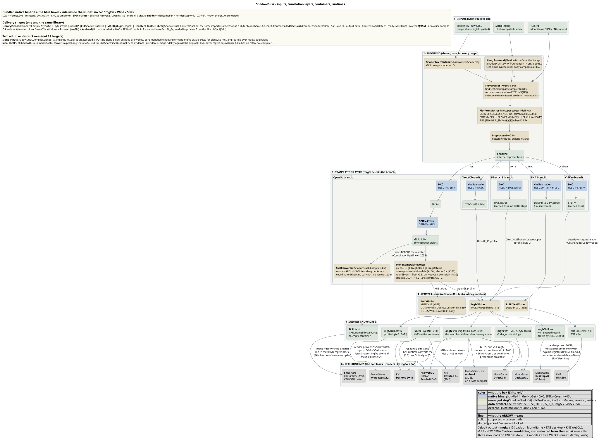

# The Faithful Pipeline

ShadowDusk runs **one faithful pipeline on every host** — desktop, CLI, in-browser WASM, and on-device Android. A host never swaps in a different frontend/compiler to "make a platform work": a different compiler produces different output and would silently break the "identical to `mgfxc`" promise.

The whole picture — inputs, the shared frontend, the per-target translation layers, the container writers, and the real runtimes — at a glance:



```text
HLSL → [DXC] → SPIR-V → [SPIRV-Cross] → GLSL → [managed: reflect + MojoShader-dialect rewrite + MGFX writer] → .mgfx
                                                                          (or vkd3d-shader → DXBC for DirectX)
```

- **OpenGL / WebGL:** HLSL → DXC → SPIR-V → SPIRV-Cross → GLSL, then the managed [`MonoGameGlslRewriter`](glsl-dialect-rewrite.md) (MojoShader dialect) and the [MGFX writer](mgfx-format.md).
- **DirectX (DX11):** HLSL → **`vkd3d-shader`** → DXBC (SM5). **DXC is not used here** — it only emits SM6 DXIL, which MonoGame's DX11 runtime cannot load. See [DirectX DXBC (vkd3d) Path](directx-dxbc-vkd3d.md).

The diagram and per-phase notes below are maintained in the repository and reproduced here as the single source of truth:

[!INCLUDE [compilation-pipeline](../../docs/references/compilation-pipeline.md)]
